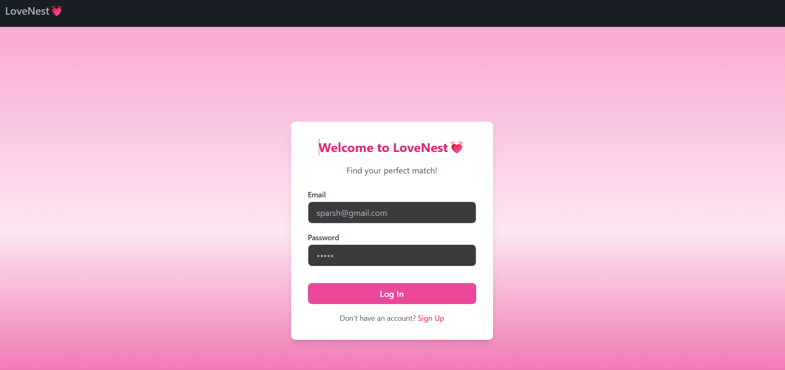
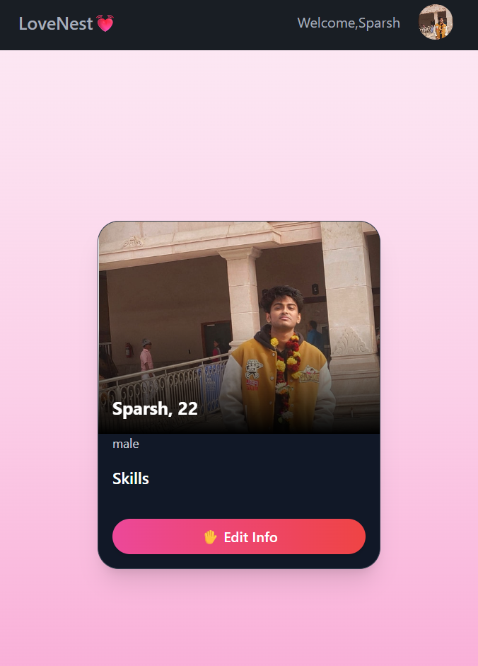
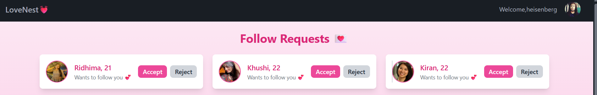
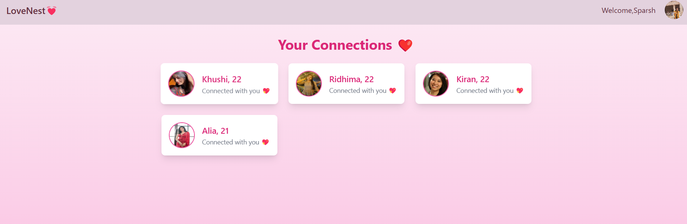

## 💖 LOVE-NEST — Frontend (React)

LOVE-NEST is a modern, Tinder-inspired web application built with the MERN stack. This is the **frontend** repository, developed using **React.js**, **Tailwind CSS**, **Socket.IO**, and a component-based architecture for real-time social interactions.

## 🧱 Tech Stack

- **Frontend Framework:** React.js (Vite)
- **Styling:** Tailwind CSS
- **Real-time:** Socket.IO client
- **Routing:** React Router DOM
- **State Management:** Context API (or Redux)
- **Auth:** JWT (JSON Web Tokens)
- **Build Tool:** Vite

## 📸 Screenshots

### 🔐 Login Page

### Feed

### 🧑‍🤝‍🧑 Profile

### Follow Request

### 🧑 Connesctions

🚀 Features

- 🎯 **Preference-Based Feed** — Displays profiles based on gender preferences and omits already friended or requested users.
- 💌 **Friend Request System** — Send, cancel, and accept requests with dynamic UI updates.
- 💬 **Real-Time Chat** — Bi-directional messaging powered by Socket.IO for seamless communication.
- 🔐 **JWT Authentication** — Login/signup and route protection via JWT tokens.
- ⚛️ **Global State Handling** — Easily extendable via Redux or Context API.
- 📱 **Responsive Design** — Optimized for desktop and mobile screens.

## 📁 Project Structure

src/
├── components/ # Reusable UI components
├── utils/ # Socket connections, constants
│ └── const.js # BASE_URL and Socket.IO setup
├── App.jsx # Main app wrapper with routes
├── main.jsx # Entry point for React
├── index.css # Tailwind base styles

## ⚙️ Setup Instructions

### 1. Clone the Repo

git clone https://github.com/Sparsh313/Lovenest-web.git
cd dev-tinder-web

### 2. Install Dependencies

-npm install

# 3. Environment Variables

-VITE_API_URL=http://localhost:7777
-VITE_SOCKET_URL=http://localhost:7777

# Run the Development Server

npm run dev

# 📬 Contact

👤 Author: Sparsh singh
🔗 GitHub: @Sparsh313
🔗 Linkedin:https://www.linkedin.com/in/sparsh-singh-895320253/
